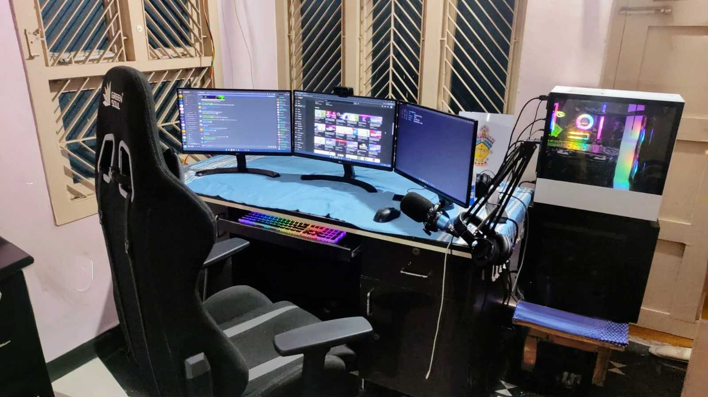

<h1 align="center">👨‍🏭 Hackintosh 2020</h1>

- Guide 👉 https://dortania.github.io/OpenCore-Install-Guide
- Build video 👉 https://www.youtube.com/watch?v=Dxx2VVPnOT4

## 🖥️ Hardware Specs

- 3 LG 22' 22MP68VQ IPS monitors
- ASUS ROG Strix Z390-F GAMING motherboard
- NZXT H510 Case
- Corsair TX750M power supply
- ADATA XPG Spectrix D60G 16GB @ 3200Mhz RAM
- MSI Radeon RX850 Armor 8GB OC+ graphic card
- Intel Core i5-9600K @ 3.70 GHz Coffee Lake CPU
- 2 ADATA XGP M.2 NVMe SSD 256GB, 1 SAMSUNG EVO 850 256GB and 1 ADATA SU800 256GB

## ⚙️ Firmware Drivers
1. [HFSPlus.efi](https://github.com/acidanthera/OcBinaryData/blob/master/Drivers/HfsPlus.efi?raw=true)
2. OpenRuntime.efi (bundled with OpenCore)
3. OpenCanopy.efi (bundled with OpenCore)

## 🔌 Kexts

1. [AppleALC](https://github.com/acidanthera/AppleALC/releases)
2. [IntelMausi](https://github.com/acidanthera/IntelMausi/releases)
3. [Lilu](https://github.com/acidanthera/Lilu/releases)
4. [VirtualSMC](https://github.com/acidanthera/VirtualSMC/releases)
5. [WhateverGreen](https://github.com/acidanthera/WhateverGreen/releases)

## 👕 Resources
Download [Resources Directory](https://github.com/acidanthera/OcBinaryData/tree/master/Resources) and install install in OpenCore.